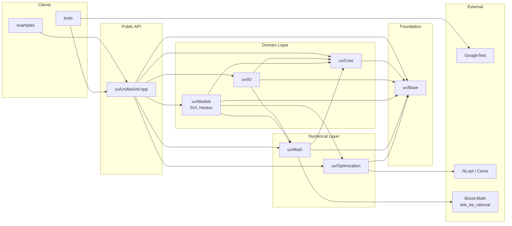

# Architecture

The repository is organized as a layered library: examples and tests use the
public headers under `uv/`; model implementations depend on shared core,
mathematical, and optimization components; low-level callback or implementation
details are kept out of the public API.

In the diagram below, arrows mean "depends on, includes, or calls".

